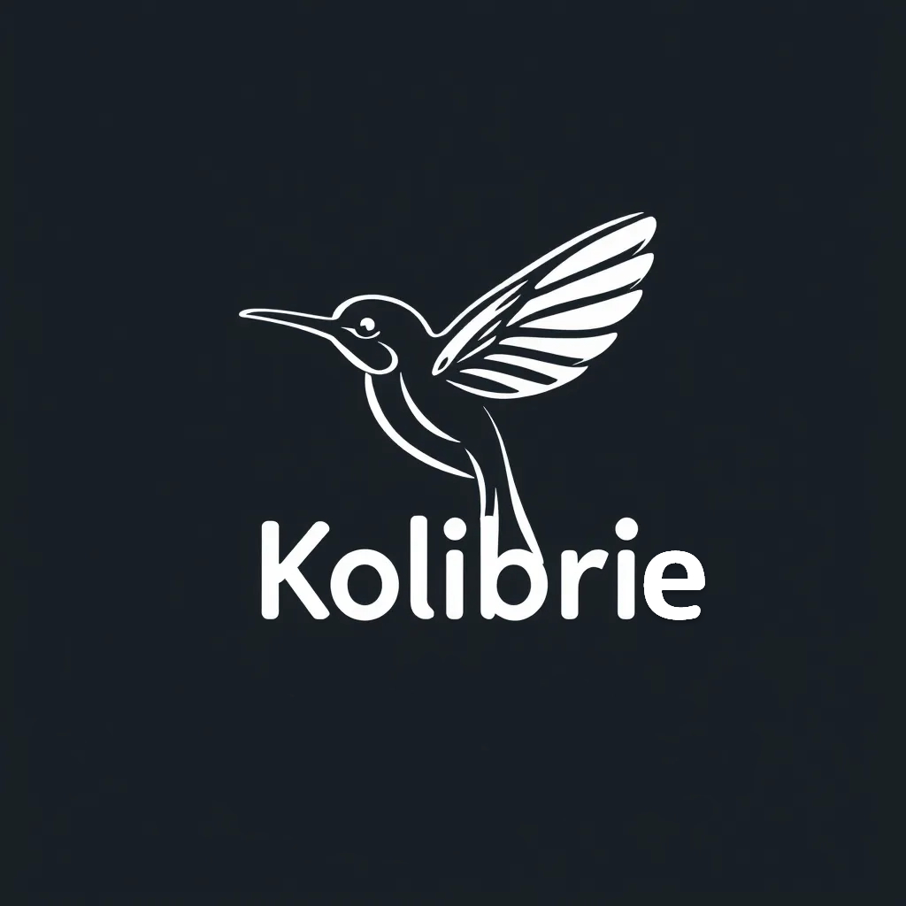

# Kolibrie

<p align="center">
    
</p>

<!--  -->


[ [English](README.md) | [Nederlands](docs/README.nl.md) | [Deutsch](docs/README.de.md) | [Español](docs/README.es.md) | [Français](docs/README.fr.md) | [日本語](docs/README.ja.md) ]

**Kolibrie** is a high-performance, concurrent, and feature-rich SPARQL query engine implemented in Rust. Designed for scalability and efficiency, it leverages Rust's robust concurrency model and advanced optimizations, including SIMD (Single Instruction, Multiple Data) and parallel processing with Rayon, to handle large-scale RDF (Resource Description Framework) datasets seamlessly.

With a comprehensive API, **Kolibrie** facilitates parsing, storing, and querying RDF data using SPARQL, Turtle, and N3 formats. Its advanced filtering, aggregation, join operations, and sophisticated optimization strategies make it a suitable choice for applications requiring complex semantic data processing. Additionally, the integration of the Volcano Optimizer and Knowledge Graph capabilities empowers users to perform cost-effective query planning and leverage rule-based inference for enhanced data insights.

## Research Context

**Kolibrie** is developed within the [Stream Intelligence Lab](https://kulak.kuleuven.be/nl/onderzoek/Onderzoeksdomeinen/stream-intelligence-lab) at KU Leuven, under the supervision of Prof. Pieter Bonte. The Stream Intelligence Lab focuses on **Stream Reasoning**, an emerging research field that integrates logic-based techniques from artificial intelligence with data-driven machine learning approaches to derive timely and actionable insights from continuous data streams. Our research emphasizes applications in the Internet of Things (IoT) and Edge processing, enabling real-time decision-making in dynamic environments such as autonomous vehicles, robotics, and web analytics.

For more information about our research and ongoing projects, please visit the [Stream Intelligence Lab website](https://kulak.kuleuven.be/nl/onderzoek/Onderzoeksdomeinen/stream-intelligence-lab).

## Features

- **Efficient RDF Parsing**: Supports parsing RDF/XML, Turtle, and N3 formats with robust error handling and prefix management.
- **Concurrent Processing**: Utilizes Rayon and Crossbeam for parallel data processing, ensuring optimal performance on multi-core systems.
- **SIMD Optimizations**: Implements SIMD instructions for accelerated query filtering and aggregation.
- **Flexible Querying**: Supports complex SPARQL queries, including SELECT, INSERT, FILTER, GROUP BY, and VALUES clauses.
- **Volcano Optimizer**: Incorporates a cost-based query optimizer based on the Volcano model to determine the most efficient execution plans.
- **Knowledge Graph**: Provides robust support for building and querying knowledge graphs, including ABox (instance-level) and TBox (schema-level) assertions, dynamic rule-based inference, and backward chaining.
- **Streaming and Sliding Windows**: Handles timestamped triples and sliding window operations for time-based data analysis.
- **Extensible Dictionary Encoding**: Efficiently encodes and decodes RDF terms using a customizable dictionary.
- **Comprehensive API**: Offers a rich set of methods for data manipulation, querying, and result processing.

> [!WARNING]
> utilizing CUDA is experimental and under the development

## Installation

### Native Installation

Ensure you have [Rust](https://www.rust-lang.org/tools/install) installed (version 1.60 or higher).

Add **Kolibrie** to your `Cargo.toml`:

```toml
[dependencies]
kolibrie = "0.1.0"
```

Then, include it in your project:

```rust
use kolibrie::SparqlDatabase;
```

### Docker Installation

**Kolibrie** provides Docker support with multiple configurations for different use cases. The Docker setup automatically handles all dependencies including Rust, CUDA (for GPU builds), and Python ML frameworks.

#### Prerequisites

- [Docker](https://docs.docker.com/get-docker/) installed
- [Docker Compose](https://docs.docker.com/compose/install/) installed
- For GPU support: [NVIDIA Docker runtime](https://github.com/NVIDIA/nvidia-docker) installed

#### Quick Start

1. **CPU-only build** (recommended for most users):
```bash
docker compose --profile cpu up --build
```

2. **GPU-enabled build** (requires NVIDIA GPU and nvidia-docker):
```bash
docker compose --profile gpu up --build
```

3. **Development build** (auto-detects GPU availability):
```bash
docker compose --profile dev up --build
```

## Usage

### Initializing the Database

Create a new instance of the `SparqlDatabase`:

```rust
use kolibrie::SparqlDatabase;

fn main() {
    let mut db = SparqlDatabase::new();
    // Your code here
}
```

### Parsing RDF Data

**Kolibrie** supports parsing RDF data from files or strings in various formats.

#### Parsing RDF/XML from a File

```rust
db.parse_rdf_from_file("data.rdf");
```

#### Parsing Turtle Data from a String

```rust
let turtle_data = r#"
@prefix ex: <http://example.org/> .

ex:Alice ex:knows ex:Bob .
ex:Bob ex:knows ex:Charlie .
"#;

db.parse_turtle(turtle_data);
```

#### Parsing N3 Data from a String

```rust
let n3_data = r#"
@prefix ex: <http://example.org/> .

ex:Alice ex:knows ex:Bob .
ex:Bob ex:knows ex:Charlie .
"#;

db.parse_n3(n3_data);
```

### Executing SPARQL Queries

Execute SPARQL queries to retrieve and manipulate data.

#### Basic Query

```rust
let sparql_query = r#"
PREFIX ex: <http://example.org/>
SELECT ?s ?o
WHERE {
    ?s ex:knows ?o .
}
"#;

let results = execute_query(sparql_query, &mut db);

for row in results {
    println!("Subject: {}, Object: {}", row[0], row[1]);
}
```

#### Insert Data

```rust
let insert_query = r#"
PREFIX ex: <http://example.org/>
INSERT {
    ex:Charlie ex:knows ex:David .
}
WHERE {
    ex:Bob ex:knows ex:Charlie .
}
"#;

let results = execute_query(insert_query, &mut db);
// Insert operations do not return results
```

### Using the Volcano Optimizer

The **Volcano Optimizer** is integrated within **Kolibrie** to optimize query execution plans based on cost estimation. It transforms logical query plans into efficient physical plans using various join strategies and applies cost-based decisions to select the most performant execution path.

#### Example: Optimized Query Execution

```rust
use kolibrie::{SparqlDatabase, execute_query, VolcanoOptimizer};

fn main() {
    let mut db = SparqlDatabase::new();

    // Parse Turtle data
    let turtle_data = r#"
    @prefix ex: <http://example.org/> .

    ex:Alice ex:knows ex:Bob .
    ex:Bob ex:knows ex:Charlie .
    ex:Charlie ex:knows ex:David .
    "#;
    db.parse_turtle(turtle_data);

    // Define the SPARQL query
    let sparql_query = r#"
    PREFIX ex: <http://example.org/>
    SELECT ?person ?location
    WHERE {
        ?person ex:knows ?org .
        ?org ex:located ?location .
    }
    "#;

    // Execute the query with optimized plan
    let results = execute_query(sparql_query, &mut db);

    for row in results {
        println!("Person: {}, Location: {}", row[0], row[1]);
    }
}
```

### Working with the Knowledge Graph

The **Knowledge Graph** component allows you to build and manage semantic networks with both instance-level (ABox) and schema-level (TBox) information. It supports dynamic rule-based inference and backward chaining to derive new knowledge from existing data.

#### Example: Building and Querying a Knowledge Graph

```rust
use kolibrie::{KnowledgeGraph, Triple};

fn main() {
    let mut kg = KnowledgeGraph::new();

    // Add TBox triples (schema)
    kg.add_tbox_triple("http://example.org/Person", "http://www.w3.org/1999/02/22-rdf-syntax-ns#type", "http://www.w3.org/2000/01/rdf-schema#Class");
    kg.add_tbox_triple("http://example.org/knows", "http://www.w3.org/1999/02/22-rdf-syntax-ns#type", "http://www.w3.org/2000/01/rdf-schema#Property");

    // Add ABox triples (instances)
    kg.add_abox_triple("http://example.org/Alice", "http://www.w3.org/1999/02/22-rdf-syntax-ns#type", "http://example.org/Person");
    kg.add_abox_triple("http://example.org/Alice", "http://example.org/knows", "http://example.org/Bob");

    // Define and add rules
    let rule = Rule {
        premise: vec![
            (
                Term::Variable("x".to_string()),
                Term::Constant(kg.dictionary.encode("http://example.org/knows")),
                Term::Variable("y".to_string()),
            )
        ],
        conclusion: (
            Term::Variable("y".to_string()),
            Term::Constant(kg.dictionary.encode("http://example.org/knownBy")),
            Term::Variable("x".to_string()),
        ),
    };
    kg.add_rule(rule);

    // Infer new facts based on rules
    kg.infer_new_facts();

    // Query the Knowledge Graph
    let inferred_facts = kg.query_abox(
        Some("http://example.org/Bob"),
        Some("http://example.org/knownBy"),
        Some("http://example.org/Alice"),
    );

    for triple in inferred_facts {
        println!(
            "<{}> -- <{}> -- <{}> .",
            kg.dictionary.decode(triple.subject).unwrap(),
            kg.dictionary.decode(triple.predicate).unwrap(),
            kg.dictionary.decode(triple.object).unwrap()
        );
    }
}
```

**Output:**
```
<http://example.org/Bob> -- <http://example.org/knownBy> -- <http://example.org/Alice> .
```

## API Documentation

### `SparqlDatabase` Struct

The `SparqlDatabase` struct is the core component representing the RDF store and providing methods for data manipulation and querying.

```rust
pub struct SparqlDatabase {
    pub triples: BTreeSet<Triple>,
    pub streams: Vec<TimestampedTriple>,
    pub sliding_window: Option<SlidingWindow>,
    pub dictionary: Dictionary,
    pub prefixes: HashMap<String, String>,
}
```

#### Fields

- **triples**: Stores RDF triples in a sorted set for efficient querying.
- **streams**: Holds timestamped triples for streaming and temporal queries.
- **sliding_window**: Optional sliding window for time-based data analysis.
- **dictionary**: Encodes and decodes RDF terms for storage efficiency.
- **prefixes**: Manages namespace prefixes for resolving prefixed terms.

### `VolcanoOptimizer` Struct

The `VolcanoOptimizer` implements a cost-based query optimizer based on the Volcano model. It transforms logical query plans into efficient physical plans by evaluating different physical operators and selecting the one with the lowest estimated cost.

```rust
pub struct VolcanoOptimizer {
    pub memo: HashMap<String, PhysicalOperator>,
    pub selected_variables: Vec<String>,
    pub stats: DatabaseStats,
}
```

#### Fields

- **memo**: Caches optimized physical operators to avoid redundant computations.
- **selected_variables**: Keeps track of variables selected in the query.
- **stats**: Holds statistical information about the database to aid in cost estimation.

### `KnowledgeGraph` Struct

The `KnowledgeGraph` struct manages both ABox (instance-level) and TBox (schema-level) assertions, supports dynamic rule-based inference, and provides querying capabilities with backward chaining.

```rust
pub struct KnowledgeGraph {
    pub abox: BTreeSet<Triple>, // ABox: Assertions about individuals (instances)
    pub tbox: BTreeSet<Triple>, // TBox: Concepts and relationships (schema)
    pub dictionary: Dictionary,
    pub rules: Vec<Rule>, // List of dynamic rules
}
```

#### Fields

- **abox**: Stores instance-level RDF triples.
- **tbox**: Stores schema-level RDF triples.
- **dictionary**: Encodes and decodes RDF terms for storage efficiency.
- **rules**: Contains dynamic rules for inferencing new knowledge.

### Core Methods

#### `new() -> Self`

Creates a new, empty `SparqlDatabase`.

```rust
let db = SparqlDatabase::new();
```

#### `parse_rdf_from_file(&mut self, filename: &str)`

Parses RDF/XML data from a specified file and populates the database.

```rust
db.parse_rdf_from_file("data.rdf");
```

#### `parse_rdf(&mut self, rdf_xml: &str)`

Parses RDF/XML data from a string.

```rust
let rdf_xml = r#"<rdf:RDF xmlns:rdf="http://www.w3.org/1999/02/22-rdf-syntax-ns#">...</rdf:RDF>"#;
db.parse_rdf(rdf_xml);
```

#### `parse_turtle(&mut self, turtle_data: &str)`

Parses Turtle-formatted RDF data from a string.

```rust
let turtle_data = r#"
@prefix ex: <http://example.org/> .

ex:Alice ex:knows ex:Bob .
"#;
db.parse_turtle(turtle_data);
```

#### `parse_n3(&mut self, n3_data: &str)`

Parses N3-formatted RDF data from a string.

```rust
let n3_data = r#"
@prefix ex: <http://example.org/> .

ex:Alice ex:knows ex:Bob .
"#;
db.parse_n3(n3_data);
```

#### `execute_query(sparql: &str, database: &mut SparqlDatabase) -> Vec<Vec<String>>`

Executes a SPARQL query against the database and returns the results.

```rust
let sparql_query = "SELECT ?s WHERE { ?s ex:knows ex:Bob . }";
let results = execute_query(sparql_query, &mut db);
```

#### `filter<F>(&self, predicate: F) -> Self`

Filters triples based on a predicate function.

```rust
let filtered_db = db.filter(|triple| triple.predicate == some_predicate_id);
```

#### `add_stream_data(&mut self, triple: Triple, timestamp: u64)`

Adds a timestamped triple to the streams.

```rust
let triple = Triple { subject: ..., predicate: ..., object: ... };
db.add_stream_data(triple, 1625097600);
```

#### `time_based_window(&self, start: u64, end: u64) -> BTreeSet<Triple>`

Retrieves triples within a specified time window.

```rust
let window_triples = db.time_based_window(1625097600, 1625184000);
```

### `VolcanoOptimizer` Methods

#### `new(database: &SparqlDatabase) -> Self`

Creates a new instance of the `VolcanoOptimizer` with statistical data gathered from the provided database.

```rust
let optimizer = VolcanoOptimizer::new(&db);
```

#### `find_best_plan(&mut self, logical_plan: &LogicalOperator) -> PhysicalOperator`

Determines the most efficient physical execution plan for a given logical query plan.

```rust
let best_plan = optimizer.find_best_plan(&logical_plan);
```

### `KnowledgeGraph` Methods

#### `new() -> Self`

Creates a new, empty `KnowledgeGraph`.

```rust
let kg = KnowledgeGraph::new();
```

#### `add_tbox_triple(&mut self, subject: &str, predicate: &str, object: &str)`

Adds a TBox triple (schema-level information) to the knowledge graph.

```rust
kg.add_tbox_triple("http://example.org/Person", "rdf:type", "rdfs:Class");
```

#### `add_abox_triple(&mut self, subject: &str, predicate: &str, object: &str)`

Adds an ABox triple (instance-level information) to the knowledge graph.

```rust
kg.add_abox_triple("http://example.org/Alice", "http://example.org/knows", "http://example.org/Bob");
```

#### `add_rule(&mut self, rule: Rule)`

Adds a dynamic rule to the knowledge graph for inferencing.

```rust
let rule = Rule { ... };
kg.add_rule(rule);
```

#### `infer_new_facts(&mut self) -> Vec<Triple>`

Performs rule-based inference to derive new triples and updates the ABox accordingly.

```rust
let inferred = kg.infer_new_facts();
```

#### `query_abox(&mut self, subject: Option<&str>, predicate: Option<&str>, object: Option<&str>) -> Vec<Triple>`

Queries the ABox for instance-level assertions based on optional subject, predicate, and object filters.

```rust
let results = kg.query_abox(Some("http://example.org/Alice"), None, None);
```

#### `query_tbox(&mut self, subject: Option<&str>, predicate: Option<&str>, object: Option<&str>) -> Vec<Triple>`

Queries the TBox for schema-level assertions based on optional subject, predicate, and object filters.

```rust
let results = kg.query_tbox(Some("http://example.org/Person"), Some("rdf:type"), Some("rdfs:Class"));
```

## Examples

### Basic Query

```rust
use kolibrie::{SparqlDatabase, execute_query};

fn main() {
    let mut db = SparqlDatabase::new();

    // Parse Turtle data
    let turtle_data = r#"
    @prefix ex: <http://example.org/> .

    ex:Alice ex:knows ex:Bob .
    ex:Bob ex:knows ex:Charlie .
    "#;
    db.parse_turtle(turtle_data);

    // Execute a SPARQL SELECT query
    let sparql_query = r#"
    PREFIX ex: <http://example.org/>
    SELECT ?s ?o
    WHERE {
        ?s ex:knows ?o .
    }
    "#;

    let results = execute_query(sparql_query, &mut db);

    for row in results {
        println!("Subject: {}, Object: {}", row[0], row[1]);
    }
}
```

**Output:**
```
Subject: http://example.org/Alice, Object: http://example.org/Bob
Subject: http://example.org/Bob, Object: http://example.org/Charlie
```

### Advanced Filtering and Aggregation

```rust
use kolibrie::{SparqlDatabase, execute_query};

fn main() {
    let mut db = SparqlDatabase::new();

    // Parse Turtle data
    let turtle_data = r#"
    @prefix ex: <http://example.org/> .

    ex:Alice ex:age "30" .
    ex:Bob ex:age "25" .
    ex:Charlie ex:age "35" .
    "#;
    db.parse_turtle(turtle_data);

    // Execute a SPARQL SELECT query with FILTER and GROUP BY
    let sparql_query = r#"
    PREFIX ex: <http://example.org/>
    SELECT AVG(?age) AS ?averageAge
    WHERE {
        ?s ex:age ?age .
        FILTER (?age > "20")
    }
    GROUPBY ?averageAge
    "#;

    let results = execute_query(sparql_query, &mut db);

    for row in results {
        println!("Average Age: {}", row[0]);
    }
}
```

**Output:**
```
Average Age: 30
```

### Optimized Query Execution with Volcano Optimizer

```rust
use kolibrie::{SparqlDatabase, execute_query, VolcanoOptimizer};

fn main() {
    let mut db = SparqlDatabase::new();

    // Parse Turtle data
    let turtle_data = r#"
    @prefix ex: <http://example.org/> .

    ex:Alice ex:knows ex:Bob .
    ex:Bob ex:knows ex:Charlie .
    ex:Charlie ex:knows ex:David .
    "#;
    db.parse_turtle(turtle_data);

    // Define the SPARQL query
    let sparql_query = r#"
    PREFIX ex: <http://example.org/>
    SELECT ?person ?location
    WHERE {
        ?person ex:knows ?org .
        ?org ex:located ?location .
    }
    "#;

    // Execute the query with optimized plan
    let results = execute_query(sparql_query, &mut db);

    for row in results {
        println!("Person: {}, Location: {}", row[0], row[1]);
    }
}
```

**Output:**
```
Person: http://example.org/Alice, Location: http://example.org/Kulak
Person: http://example.org/Bob, Location: http://example.org/Kortrijk
Person: http://example.org/Charlie, Location: http://example.org/Ughent
```

### Building and Querying a Knowledge Graph

```rust
use kolibrie::{KnowledgeGraph, Rule, Term};

fn main() {
    let mut kg = KnowledgeGraph::new();

    // Add TBox triples (schema)
    kg.add_tbox_triple("http://example.org/Person", "rdf:type", "rdfs:Class");
    kg.add_tbox_triple("http://example.org/knows", "rdf:type", "rdf:Property");
    kg.add_tbox_triple("http://example.org/knownBy", "rdf:type", "rdf:Property");

    // Add ABox triples (instances)
    kg.add_abox_triple("http://example.org/Alice", "rdf:type", "http://example.org/Person");
    kg.add_abox_triple("http://example.org/Alice", "http://example.org/knows", "http://example.org/Bob");
    kg.add_abox_triple("http://example.org/Bob", "rdf:type", "http://example.org/Person");
    kg.add_abox_triple("http://example.org/Bob", "http://example.org/knows", "http://example.org/Charlie");

    // Define and add rules
    let rule = Rule {
        premise: vec![
            (
                Term::Variable("x".to_string()),
                Term::Constant(kg.dictionary.encode("http://example.org/knows")),
                Term::Variable("y".to_string()),
            )
        ],
        conclusion: (
            Term::Variable("y".to_string()),
            Term::Constant(kg.dictionary.encode("http://example.org/knownBy")),
            Term::Variable("x".to_string()),
        ),
    };
    kg.add_rule(rule);

    // Infer new facts based on rules
    let inferred_facts = kg.infer_new_facts();

    // Query the Knowledge Graph
    let queried_facts = kg.query_abox(
        Some("http://example.org/Bob"),
        Some("http://example.org/knownBy"),
        Some("http://example.org/Alice"),
    );

    for triple in queried_facts {
        println!(
            "<{}> -- <{}> -- <{}> .",
            kg.dictionary.decode(triple.subject).unwrap(),
            kg.dictionary.decode(triple.predicate).unwrap(),
            kg.dictionary.decode(triple.object).unwrap()
        );
    }
}
```

**Output:**
```
Inferred new fact: Triple { subject: 2, predicate: 4, object: 1 }
<http://example.org/Bob> -- <http://example.org/knownBy> -- <http://example.org/Alice> .
```

## Performance

**Kolibrie** is optimized for high performance through:

- **Parallel Parsing and Processing**: Utilizes Rayon and Crossbeam for multi-threaded data parsing and query execution.
- **SIMD Instructions**: Implements SIMD operations to accelerate filtering and aggregation tasks.
- **Volcano Optimizer**: Employs a cost-based query optimizer to generate efficient physical execution plans, minimizing query execution time.
- **Knowledge Graph Inference**: Leverages rule-based inference and backward chaining to derive new knowledge without significant performance overhead.
- **Efficient Data Structures**: Employs `BTreeSet` for sorted storage and `HashMap` for prefix management, ensuring quick data retrieval and manipulation.
- **Memory Optimization**: Uses dictionary encoding to minimize memory footprint by reusing repeated terms.

Benchmarking indicates significant performance gains on large RDF datasets compared to traditional single-threaded SPARQL engines.

### Kolibrie vs. Oxigraph vs. RDFlib vs. Apache Jena (RDF/XML triples 100K)
**Time taken to load RDF data**
| Kolibrie  | Oxigraph | RDFlib    |Apache Jena|
|----------|----------|-----------|-----------|
| 759.02ms | 10.21s   | 23.41s    | 2.32s     |
| 765.30ms | 10.32s   | 26.69s    | 2.20s     |
| 767.80ms | 10.26s   | 28.61s    | 2.15s     |
| 763.89ms | 10.34s   | 30.36s    | 2.11s     |
| 757.12ms | 10.34s   | 30.39s    | 2.12s     |
| 755.35ms | 10.26s   | 30.53s    | 2.17s     |
| 765.97ms | 10.17s   | 30.65s    | 2.08s     |
| 761.93ms | 10.27s   | 28.82s    | 2.10s     |
| 771.49ms | 10.17s   | 28.55s    | 2.10s     |
| 763.96ms | 10.32s   | 30.29s    | 2.11s     |
| 767.13ms | 10.23s   | 30.29s    | 2.10s     |
| 772.74ms | 10.28s   | 30.21s    | 2.07s     |
| 759.49ms | 10.23s   | 32.39s    | 2.24s     |
| 764.33ms | 10.37s   | 28.78s    | 2.11s     |
| 765.96ms | 10.14s   | 28.51s    | 2.21s     |
| 776.03ms | 10.36s   | 30.28s    | 2.16s     |
| 773.43ms | 10.17s   | 30.63s    | 2.18s     |
| 763.02ms | 10.17s   | 28.67s    | 2.18s     |
| 751.50ms | 10.28s   | 30.42s    | 2.20s     |
| 764.07ms | 10.32s   | 30.37s    | 2.16s     |

**Time taken to execute SPARQL query**
| Kolibrie |Kolibrie GPU| Oxigraph| RDFlib    |Apache Jena|
|----------|-----------|----------|-----------|-----------|
| 218.07ms | 258.00ms  | 982.44ms | 502.88 ms | 797.67ms  |
| 215.86ms | 160.63ms  | 984.54ms | 2.21 ms   | 796.11ms  |
| 213.93ms | 160.07ms  | 983.53ms | 2.31 ms   | 749.51ms  |
| 218.92ms | 155.51ms  | 994.63ms | 2.28 ms   | 761.53ms  |
| 218.17ms | 149.08ms  | 990.50ms | 1.98 ms   | 740.22ms  |
| 213.32ms | 150.04ms  | 996.63ms | 2.38 ms   | 732.42ms  |
| 213.98ms | 151.96ms  | 977.26ms | 2.14 ms   | 750.46ms  |
| 214.59ms | 150.71ms  | 985.31ms | 2.30 ms   | 753.79ms  |
| 209.54ms | 151.30ms  | 985.94ms | 1.98 ms   | 759.01ms  |
| 216.22ms | 156.90ms  | 976.10ms | 1.97 ms   | 743.88ms  |
| 211.11ms | 156.79ms  | 997.83ms | 1.93 ms   | 740.65ms  |
| 217.72ms | 159.22ms  | 978.09ms | 2.28 ms   | 753.59ms  |
| 219.35ms | 150.92ms  | 989.44ms | 1.98 ms   | 832.77ms  |
| 211.71ms | 151.06ms  | 983.64ms | 2.27 ms   | 761.30ms  |
| 220.93ms | 151.12ms  | 978.75ms | 1.90 ms   | 745.90ms  |
| 219.62ms | 155.15ms  | 985.96ms | 1.89 ms   | 755.21ms  |
| 209.10ms | 152.89ms  | 986.19ms | 2.29 ms   | 793.17ms  |
| 215.82ms | 149.14ms  | 986.04ms | 2.62 ms   | 757.18ms  |
| 215.88ms | 150.95ms  | 979.21ms | 1.98 ms   | 757.05ms  |
| 212.52ms | 150.35ms  | 985.24ms | 1.90 ms   | 753.47ms  |

**Summary of Kolibrie**

Total Parsing Time: 15.29 seconds

Total Query Execution Time: 4.31 seconds

Average Parsing Time: 0.76 seconds

Average Query Execution Time: 0.22 seconds

**Summary of Oxigraph**

Total RDF Loading Time: 205.21 seconds

Total Query Execution Time: 19.71 seconds

Average RDF Loading Time: 10.26 seconds

Average Query Execution Time: 0.99 seconds

**Summary of RDFlib**

Total RDF Loading Time: 588.86 seconds

Total SPARQL Query Execution Time: 0.54 seconds

Average RDF Loading Time: 29.44 seconds

Average SPARQL Query Execution Time: 27.17 ms

**Summary of Apache Jena**

Total RDF Loading Time: 43.07 seconds

Total SPARQL Query Execution Time: 15.23 seconds

Average RDF Loading Time: 2.15 seconds

Average SPARQL Query Execution Time: 761.74 ms

## How to Contribute

### Submitting Issues
Use the Issue Tracker to submit bug reports and feature/enhancement requests. Before submitting a new issue, ensure that there is no similar open issue.

### Manual Testing
Anyone manually testing the code and reporting bugs or suggestions for enhancements in the Issue Tracker are very welcome!

### Submitting Pull Requests
Patches/fixes are accepted in form of pull requests (PRs). Make sure the issue the pull request addresses is open in the Issue Tracker.

Submitted pull request is deemed to have agreed to publish under Mozilla Public License Version 2.0.

## License

Kolibrie is licensed under the [MPL-2.0 License](LICENSE).
