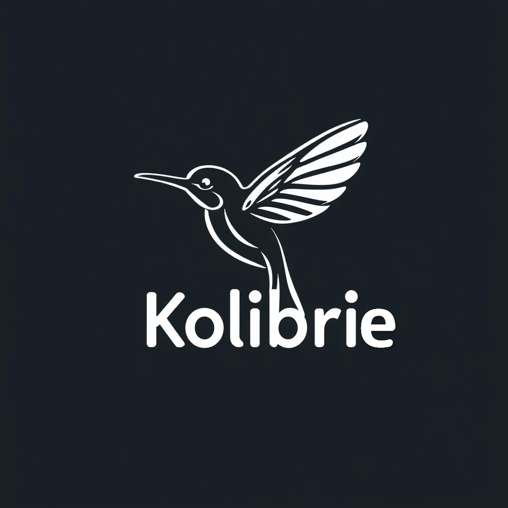
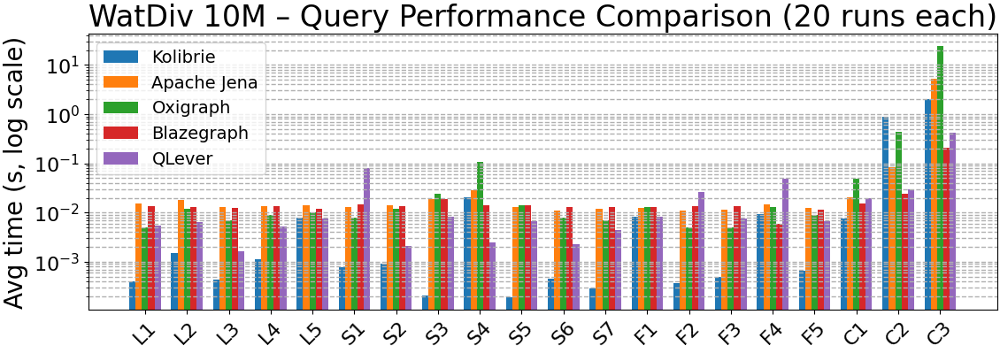
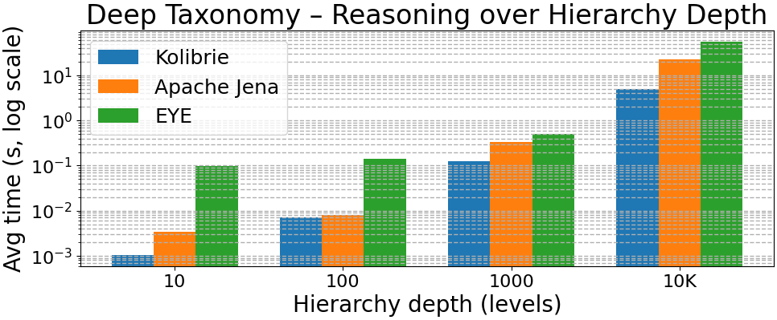

# Kolibrie

<p align="center">
    
</p>

<!--  -->
[](https://github.com/StreamIntelligenceLab/Kolibrie/tree/main)


[](https://discord.gg/KcFXrUUyYm)
<!---->

[ [English](../README.md) | [Nederlands](README.nl.md) | [Deutsch](README.de.md) | [Español](README.es.md) | [Français](README.fr.md) | [日本語](README.ja.md) ]

**Kolibrie** ist eine leistungsstarke, nebenläufige und funktionsreiche SPARQL-Abfrage-Engine, die in Rust implementiert ist. Entwickelt für Skalierbarkeit und Effizienz nutzt sie das robuste Nebenläufigkeitsmodell von Rust sowie fortschrittliche Optimierungen, einschließlich SIMD (Single Instruction, Multiple Data) und paralleler Verarbeitung mit Rayon, um nahtlos mit groß angelegten RDF (Resource Description Framework)-Datensätzen umzugehen.

Mit einer umfassenden API erleichtert **Kolibrie** das Parsen, Speichern und Abfragen von RDF-Daten in SPARQL-, Turtle- und N3-Formaten. Ihre fortschrittlichen Filter-, Aggregations-, Join-Operationen und ausgefeilten Optimierungsstrategien machen sie zu einer geeigneten Wahl für Anwendungen, die komplexe semantische Datenverarbeitung erfordern. Darüber hinaus ermöglicht die Integration des Volcano Optimizer und der Knowledge-Graph-Funktionen den Benutzern, kosteneffiziente Abfrageplanung durchzuführen und regelbasierte Inferenz für erweiterte Datenanalysen zu nutzen.

## Forschungskontext

**Kolibrie** wird innerhalb des [Stream Intelligence Lab](https://kulak.kuleuven.be/nl/onderzoek/Onderzoeksdomeinen/stream-intelligence-lab) an der KU Leuven unter der Leitung von Prof. Pieter Bonte entwickelt. Das Stream Intelligence Lab konzentriert sich auf **Stream Reasoning**, ein aufstrebendes Forschungsfeld, das logisch-basierte Techniken aus der künstlichen Intelligenz mit datengesteuerten maschinellen Lernansätzen integriert, um zeitnahe und umsetzbare Erkenntnisse aus kontinuierlichen Datenströmen zu gewinnen. Unsere Forschung betont Anwendungen im Internet der Dinge (IoT) und Edge-Processing, was Echtzeit-Entscheidungen in dynamischen Umgebungen wie autonomen Fahrzeugen, Robotik und Webanalyse ermöglicht.

Für weitere Informationen über unsere Forschung und laufende Projekte besuchen Sie bitte die [Stream Intelligence Lab Website](https://kulak.kuleuven.be/nl/onderzoek/Onderzoeksdomeinen/stream-intelligence-lab).

## Funktionen

- **Effizientes RDF-Parsen**: Unterstützt das Parsen von RDF/XML-, Turtle- und N3-Formaten mit robuster Fehlerbehandlung und Prefix-Verwaltung.
- **Nebenläufige Verarbeitung**: Nutzt Rayon und Crossbeam für parallele Datenverarbeitung und gewährleistet optimale Leistung auf Multi-Core-Systemen.
- **SIMD-Optimierungen**: Implementiert SIMD-Instruktionen zur Beschleunigung von Query-Filtering und Aggregation.
- **Flexible Abfragen**: Unterstützt komplexe SPARQL-Abfragen, einschließlich SELECT-, INSERT-, FILTER-, GROUP BY- und VALUES-Klauseln.
- **Volcano Optimizer**: Integriert einen kostenbasierten Query-Optimizer basierend auf dem Volcano-Modell, um die effizientesten Ausführungspläne zu bestimmen.
- **Reasoner**: Bietet robuste Unterstützung für den Aufbau und die Abfrage von Wissensgraphen, einschließlich ABox (Instanzebene) und TBox (Schemaebene) Assertions, dynamische regelbasierte Inferenz und Backward Chaining.
- **Streaming und Sliding Windows**: Verarbeitet zeitgestempelte Triple und Sliding-Window-Operationen für zeitbasierte Datenanalysen.
- **Erweiterbare Dictionary-Encoding**: Codiert und decodiert RDF-Terme effizient mithilfe eines anpassbaren Dictionaries.
- **Umfassende API**: Bietet eine reichhaltige Sammlung von Methoden für Datenmanipulation, Abfragen und Ergebnisverarbeitung.

> [!WARNING]
> Die Nutzung von CUDA ist experimentell und in der Entwicklung.

## Installation

### Native Installation

Stellen Sie sicher, dass Sie [Rust](https://www.rust-lang.org/tools/install) installiert haben (Version 1.60 oder höher).

Klonen Sie das Repository:

```bash
git clone https://github.com/StreamIntelligenceLab/Kolibrie.git
cd Kolibrie
```

Bauen Sie das Projekt:

```bash
cargo build --release
```

Dann binden Sie es in Ihr Projekt ein:

```rust
use kolibrie::SparqlDatabase;
```

### Docker Installation

**Kolibrie** bietet Docker-Unterstützung mit mehreren Konfigurationen für verschiedene Anwendungsfälle. Das Docker-Setup behandelt automatisch alle Abhängigkeiten einschließlich Rust, CUDA (für GPU-Builds) und Python-ML-Frameworks.

#### Voraussetzungen

* [Docker](https://docs.docker.com/get-docker/) installiert
* [Docker Compose](https://docs.docker.com/compose/install/) installiert
* Für GPU-Unterstützung: [NVIDIA Docker runtime](https://github.com/NVIDIA/nvidia-docker) installiert

#### Schnellstart

1. **Nur CPU-Build** (empfohlen für die meisten Benutzer):

```bash
docker compose --profile cpu up --build
```

2. **GPU-aktivierter Build** (erfordert NVIDIA GPU und nvidia-docker):

```bash
docker compose --profile gpu up --build
```

3. **Development Build** (erkennt GPU-Verfügbarkeit automatisch):

```bash
docker compose --profile dev up --build
```

## Verwendung

### Initialisieren der Datenbank

Erstellen Sie eine neue Instanz der `SparqlDatabase`:

```rust
use kolibrie::SparqlDatabase;

fn main() {
    let mut db = SparqlDatabase::new();
    // Ihr Code hier
}
```

### RDF-Daten Parsen

**Kolibrie** unterstützt das Parsen von RDF-Daten aus Dateien oder Strings in verschiedenen Formaten.

#### RDF/XML aus einer Datei Parsen

```rust
db.parse_rdf_from_file("data.rdf");
```

#### RDF/XML aus einem String Parsen

```rust
let rdf_data = r#"
<?xml version="1.0" encoding="UTF-8"?>
<rdf:RDF 
    xmlns:rdf="http://www.w3.org/1999/02/22-rdf-syntax-ns#"
    xmlns:foaf="http://xmlns.com/foaf/0.1/">
    
    <rdf:Description rdf:about="http://example.org/alice">
        <foaf:name>Alice</foaf:name>
        <foaf:age>30</foaf:age>
    </rdf:Description>
</rdf:RDF>
"#;

db.parse_rdf(rdf_data);
```

#### Turtle-Daten aus einem String Parsen

```rust
let turtle_data = r#"
@prefix ex: <http://example.org/> .

ex:Alice ex:knows ex:Bob . 
ex:Bob ex:knows ex:Charlie .
"#;

db.parse_turtle(turtle_data);
```

#### N3-Daten aus einem String Parsen

```rust
let n3_data = r#"
@prefix ex: <http://example.org/> .

ex:Alice ex:knows ex:Bob .
ex:Bob ex:knows ex:Charlie .
"#;

db.parse_n3(n3_data);
```

#### N-Triples aus einem String Parsen

```rust
let ntriples_data = r#"
<http://example.org/john> <http://example.org/hasFriend> <http://example.org/jane> . 
<http://example.org/jane> <http://example.org/name> "Jane Doe" . 
<http://example.org/john> <http://example.org/age> "30"^^<http://www.w3.org/2001/XMLSchema#integer> .
"#;

db.parse_ntriples_and_add(ntriples_data);
```

### Triple Programmgesteuert Hinzufügen

Fügen Sie einzelne Triple direkt zur Datenbank hinzu:

```rust
db.add_triple_parts(
    "http://example.org/alice",
    "http://xmlns.com/foaf/0.1/name",
    "Alice"
);

db.add_triple_parts(
    "http://example.org/alice",
    "http://xmlns.com/foaf/0.1/age",
    "30"
);
```

### SPARQL-Abfragen Ausführen

Führen Sie SPARQL-Abfragen aus, um Daten abzurufen und zu manipulieren.

#### Grundlegende SELECT-Abfrage

```rust
use kolibrie::execute_query::execute_query;

let sparql_query = r#"
PREFIX ex: <http://example.org/>
SELECT ?s ?o
WHERE {
    ?s ex:knows ?o .
}
"#;

let results = execute_query(sparql_query, &mut db);

for row in results {
    println!("Subjekt: {}, Objekt: {}", row[0], row[1]);
}
```

#### Abfrage mit FILTER

```rust
let sparql = r#"
PREFIX ex: <http://example.org/vocab#>

SELECT ?name ?attendees
WHERE {
    ?event ex:name ?name .
    ?event ex:attendees ?attendees . 
    FILTER (?attendees > 50)
}
"#;

let results = execute_query(sparql, &mut db);

for row in results {
    println!("Event: {}, Teilnehmer: {}", row[0], row[1]);
}
```

#### Abfrage mit OR-Operator

```rust
let sparql = r#"
PREFIX ex: <http://example.org/vocab#>

SELECT ?name ?type ?attendees
WHERE {
    ?event ex:name ?name . 
    ?event ex:type ?type .
    ?event ex:attendees ?attendees . 
    FILTER (?type = "Technical" || ?type = "Academic")
}
"#;

let results = execute_query(sparql, &mut db);

for row in results {
    if let [name, type_, attendees] = &row[.. ] {
        println!("Name: {}, Typ: {}, Teilnehmer: {}", name, type_, attendees);
    }
}
```

#### Abfrage mit LIMIT

```rust
let sparql = r#"
PREFIX ex: <http://example.org/vocab#>

SELECT ?name ?type
WHERE {
    ?event ex:name ?name .
    ?event ex:type ?type .
    FILTER (?type = "Technical" || ?type = "Academic")
}
LIMIT 2
"#;

let results = execute_query(sparql, &mut db);

for row in results {
    println!("Name: {}, Typ: {}", row[0], row[1]);
}
```

#### Abfrage mit Aggregationen

```rust
let sparql = r#"
PREFIX ds: <https://data.cityofchicago.org/resource/xzkq-xp2w/>

SELECT AVG(?salary) AS ?average_salary
WHERE {
    ?employee ds:annual_salary ?salary
}
GROUPBY ?average_salary
"#;

let results = execute_query(sparql, &mut db);

for row in results {
    if let [avg_salary] = &row[.. ] {
        println!("Durchschnittsgehalt: {}", avg_salary);
    }
}
```

**Unterstützte Aggregationen:**

* `AVG(?var)` - Durchschnitt berechnen
* `COUNT(?var)` - Vorkommen zählen
* `SUM(?var)` - Werte summieren
* `MIN(?var)` - Minimum finden
* `MAX(?var)` - Maximum finden

#### Abfrage mit String-Funktionen

```rust
let sparql = r#"
PREFIX foaf: <http://xmlns.com/foaf/0.1/>

SELECT ?name
WHERE {
    ?person foaf:givenName ?first .
    ?person foaf:surname ?last
    BIND(CONCAT(?first, " ", ?last) AS ?name)
}
"#;

let results = execute_query(sparql, &mut db);

for row in results {
    println!("Vollständiger Name: {}", row[0]);
}
```

#### Verschachtelte Abfragen

```rust
let sparql = r#"
PREFIX ex: <http://example.org/>

SELECT ?friendName
WHERE {
    ?person ex:name "Alice" .
    ?person ex:knows ?friend
    {
        SELECT ?friend ?friendName
        WHERE {
            ?friend ex:name ?friendName . 
        }
    }
}"#;

let results = execute_query(sparql, &mut db);

for row in results {
    println!("Freund(in) von Alice: {}", row[0]);
}
```

### Verwendung der Query-Builder-API

Der Query Builder bietet eine fluente Schnittstelle für die programmgesteuerte Abfragekonstruktion.

#### Grundlegendes Query Building

```rust
// Alle Objekte für ein bestimmtes Prädikat holen
let results = db.query()
    .with_predicate("http://xmlns.com/foaf/0.1/name")
    .get_objects();

for object in results {
    println!("Name: {}", object);
}
```

#### Abfrage mit Filtering

```rust
let results = db.query()
    .with_predicate("http://xmlns.com/foaf/0.1/age")
    .filter(|triple| {
        // Benutzerdefinierte Filterlogik
        db.dictionary.decode(triple.object)
            .and_then(|age| age.parse::<i32>().ok())
            .map(|age| age > 25)
            .unwrap_or(false)
    })
    .get_decoded_triples();

for (subject, predicate, object) in results {
    println!("{} ist {} Jahre alt", subject, object);
}
```

#### Abfrage mit Joins

```rust
let other_db = SparqlDatabase::new();
// ... other_db befüllen ...

let results = db.query()
    .join(&other_db)
    .join_on_subject()
    .get_triples();
```

#### Abfrage mit Sortieren, Limitieren und Distinct

```rust
let results = db.query()
    .with_predicate("http://xmlns.com/foaf/0.1/name")
    .order_by(|triple| {
        db.dictionary.decode(triple.object).unwrap().to_string()
    })
    .distinct()
    .limit(10)
    .offset(5)
    .get_decoded_triples();

for (subject, predicate, object) in results {
    println!("{} - {} - {}", subject, predicate, object);
}
```

### Verwendung des Volcano Optimizers

Der **Volcano Optimizer** ist in **Kolibrie** integriert, um Abfrageausführungspläne basierend auf Kostenschätzungen zu optimieren. Er transformiert logische Abfragepläne in effiziente physische Pläne, indem er verschiedene Join-Strategien bewertet und kostenbasiert den performantesten Ausführungspfad auswählt.

#### Beispiel: Optimierte Abfrageausführung

```rust
use kolibrie::execute_query::*;
use kolibrie::sparql_database::*;

fn main() {
    let mut db = SparqlDatabase::new();

    // N-Triples-Daten parsen
    let ntriples_data = r#"
<http://example.org/john> <http://example.org/hasFriend> <http://example.org/jane> .
<http://example.org/jane> <http://example.org/name> "Jane Doe" .
<http://example.org/john> <http://example.org/name> "John Smith" . 
<http://example.org/jane> <http://example.org/age> "25"^^<http://www.w3.org/2001/XMLSchema#integer> .
<http://example.org/john> <http://example.org/age> "30"^^<http://www.w3.org/2001/XMLSchema#integer> .
    "#;

    db.parse_ntriples_and_add(ntriples_data);
    
    // Statistiken für den Optimizer bauen
    db.get_or_build_stats();

    // SPARQL-Abfrage definieren
    let sparql_query = r#"
    PREFIX ex: <http://example.org/>
    SELECT ?person ?friend ?friendName
    WHERE {
        ?person ex:hasFriend ?friend .
        ?friend ex:name ?friendName .
    }
    "#;

    // Abfrage mit optimiertem Plan ausführen
    let results = execute_query(sparql_query, &mut db);

    for row in results {
        println!("Person: {}, Freund: {}, Name des Freundes: {}", row[0], row[1], row[2]);
    }
}
```

### Arbeiten mit dem Reasoner

Die **Reasoner**-Komponente ermöglicht den Aufbau und die Verwaltung semantischer Netzwerke mit instanzbezogener (ABox) Information. Sie unterstützt dynamische regelbasierte Inferenz mittels Forward Chaining, Backward Chaining und semi-naiver Evaluation, um neues Wissen aus vorhandenen Daten abzuleiten.

#### Beispiel: Aufbau und Abfrage eines Reasoners

```rust
use datalog::knowledge_graph::Reasoner;
use shared::terms::Term;
use shared::rule::Rule;

fn main() {
    let mut kg = Reasoner::new();

    // ABox-Triple (Instanzebene) hinzufügen
    kg.add_abox_triple("Alice", "parentOf", "Bob");
    kg.add_abox_triple("Bob", "parentOf", "Charlie");

    // Transitivitätsregel für ancestorOf
    // Regel: parentOf(X, Y) ∧ parentOf(Y, Z) → ancestorOf(X, Z)
    let ancestor_rule = Rule {
        premise: vec![
            (
                Term::Variable("X".to_string()),
                Term::Constant(kg.dictionary.encode("parentOf")),
                Term::Variable("Y".to_string()),
            ),
            (
                Term::Variable("Y".to_string()),
                Term::Constant(kg.dictionary.encode("parentOf")),
                Term::Variable("Z".to_string()),
            ),
        ],
        conclusion: vec![
            (
                Term::Variable("X".to_string()),
                Term::Constant(kg.dictionary.encode("ancestorOf")),
                Term::Variable("Z".to_string()),
            )
        ],
        filters: vec![],
    };

    kg.add_rule(ancestor_rule);

    // Neue Fakten mit Forward Chaining ableiten
    let inferred_facts = kg.infer_new_facts();
    
    println!("{} neue Fakten abgeleitet", inferred_facts.len());

    // ancestorOf-Beziehungen abfragen
    let results = kg.query_abox(
        Some("Alice"),
        Some("ancestorOf"),
        None,
    );

    for triple in results {
        println!(
            "{} ist Vorfahr(in) von {}",
            kg.dictionary.decode(triple.subject).unwrap(),
            kg. dictionary.decode(triple.object).unwrap()
        );
    }
}
```

**Ausgabe:**

```
1 neue Fakten abgeleitet
Alice ist Vorfahr(in) von Charlie
```

## API-Dokumentation

### `SparqlDatabase` Struktur

Die `SparqlDatabase`-Struktur ist die Kernkomponente, die den RDF-Speicher darstellt und Methoden für Datenmanipulation und Abfragen bereitstellt.

```rust
pub struct SparqlDatabase {
    pub triples: BTreeSet<Triple>,
    pub streams: Vec<TimestampedTriple>,
    pub sliding_window: Option<SlidingWindow>,
    pub dictionary: Dictionary,
    pub prefixes: HashMap<String, String>,
    pub udfs: HashMap<String, ClonableFn>,
    pub index_manager: UnifiedIndex,
    pub rule_map: HashMap<String, String>,
    pub cached_stats: Option<Arc<DatabaseStats>>,
}
```

#### Felder

* **triples**: Speichert RDF-Triple in einer sortierten Menge für effiziente Abfragen.
* **streams**: Enthält zeitgestempelte Triple für Streaming- und zeitbezogene Abfragen.
* **sliding_window**: Optionales Sliding Window für zeitbasierte Datenanalysen.
* **dictionary**: Codiert und decodiert RDF-Terme zur Speicheroptimierung.
* **prefixes**: Verwaltet Namensraum-Prefixes zur Auflösung von abgekürzten Begriffen.
* **udfs**: Registry für User-Defined Functions (benutzerdefinierte Operationen).
* **index_manager**: Vereinheitlichtes Indexing-System für optimierte Query-Performance.
* **rule_map**: Mappt Regelnamen auf deren Definitionen.
* **cached_stats**: Gecachte Datenbankstatistiken zur Query-Optimierung.

### `Streamertail` Struktur

Der `Streamertail` implementiert einen kostenbasierten Query-Optimizer basierend auf dem Volcano-Modell. Er transformiert logische Abfragepläne in effiziente physische Pläne, indem verschiedene physische Operatoren bewertet und derjenige mit den niedrigsten geschätzten Kosten ausgewählt wird.

```rust
pub struct Streamertail<'a> {
    pub stats: Arc<DatabaseStats>,
    pub memo: HashMap<String, (PhysicalOperator, f64)>,
    pub selected_variables: Vec<String>,
    database: &'a SparqlDatabase,
}
```

#### Felder

* **stats**: Geteilte statistische Informationen über die Datenbank zur Unterstützung der Kostenschätzung.
* **memo**: Cacht optimierte physische Operatoren mitsamt Kosten, um redundante Berechnungen zu vermeiden.
* **selected_variables**: Verfolgt die in der Abfrage ausgewählten Variablen.
* **database**: Referenz auf die SPARQL-Datenbank für die Ausführung.

### `Reasoner` Struktur

Die `Reasoner`-Struktur verwaltet instanzbezogene (ABox) Assertions, unterstützt dynamische regelbasierte Inferenz und bietet Abfragefunktionen mit Forward Chaining, Backward Chaining und semi-naiver Evaluation.

```rust
pub struct Reasoner {
    pub dictionary: Dictionary,
    pub rules: Vec<Rule>,
    pub index_manager: UnifiedIndex,
    pub rule_index: RuleIndex,
    pub constraints: Vec<Rule>,
}
```

#### Felder

* **dictionary**: Codiert und decodiert RDF-Terme zur Speicheroptimierung.
* **rules**: Enthält dynamische Regeln zur Inferenz neuer Fakten.
* **index_manager**: Vereinheitlichtes Indexing-System zum Speichern und Abfragen von Tripeln.
* **rule_index**: Spezialisierter Index für effizientes Rule-Matching.
* **constraints**: Integritäts-Constraints zur Inkonsistenz-Erkennung und -Reparatur.

### Kernmethoden

#### `SparqlDatabase::new() -> Self`

Erstellt eine neue, leere `SparqlDatabase`.

```rust
let mut db = SparqlDatabase::new();
```

#### `parse_rdf_from_file(&mut self, filename: &str)`

Parst RDF/XML-Daten aus einer angegebenen Datei und füllt die Datenbank.

```rust
db.parse_rdf_from_file("data.rdf");
```

#### `parse_rdf(&mut self, rdf_xml: &str)`

Parst RDF/XML-Daten aus einem String.

```rust
let rdf_xml = r#"<rdf:RDF xmlns:rdf="http://www.w3.org/1999/02/22-rdf-syntax-ns#">... </rdf:RDF>"#;
db.parse_rdf(rdf_xml);
```

#### `parse_turtle(&mut self, turtle_data: &str)`

Parst Turtle-formatierte RDF-Daten aus einem String.

```rust
let turtle_data = r#"
@prefix ex: <http://example.org/> . 

ex:Alice ex:knows ex:Bob .
"#;
db.parse_turtle(turtle_data);
```

#### `parse_n3(&mut self, n3_data: &str)`

Parst N3-formatierte RDF-Daten aus einem String.

```rust
let n3_data = r#"
@prefix ex: <http://example.org/> . 

ex:Alice ex:knows ex:Bob .
"#;
db.parse_n3(n3_data);
```

#### `parse_ntriples_and_add(&mut self, ntriples_data: &str)`

Parst N-Triples-Daten und fügt sie der Datenbank hinzu.

```rust
let ntriples_data = r#"
<http://example.org/john> <http://example.org/hasFriend> <http://example.org/jane> . 
<http://example.org/jane> <http://example.org/name> "Jane Doe" .
"#;
db.parse_ntriples_and_add(ntriples_data);
```

#### `add_triple_parts(&mut self, subject: &str, predicate: &str, object: &str)`

Fügt ein Tripel hinzu, indem seine Teile encodiert werden.

```rust
db.add_triple_parts(
    "http://example.org/alice",
    "http://xmlns.com/foaf/0.1/name",
    "Alice"
);
```

#### `delete_triple_parts(&mut self, subject: &str, predicate: &str, object: &str) -> bool`

Löscht ein Tripel aus der Datenbank und gibt zurück, ob es erfolgreich entfernt wurde.

```rust
let deleted = db.delete_triple_parts(
    "http://example.org/alice",
    "http://xmlns.com/foaf/0.1/age",
    "30"
);
```

#### `build_all_indexes(&mut self)`

Baut alle Indizes aus den aktuellen Tripeln für optimierte Abfragen.

```rust
db.build_all_indexes();
```

#### `get_or_build_stats(&mut self) -> Arc<DatabaseStats>`

Lädt gecachte Statistiken oder baut neue für die Query-Optimierung.

```rust
let stats = db.get_or_build_stats();
```

#### `invalidate_stats_cache(&mut self)`

Invalidiert den Statistik-Cache nach Datenänderungen.

```rust
db.invalidate_stats_cache();
```

#### `query(&self) -> QueryBuilder`

Gibt eine QueryBuilder-Instanz für programmgesteuerte Abfragen zurück.

```rust
let results = db.query()
    .with_predicate("http://xmlns.com/foaf/0.1/name")
    .get_objects();
```

#### `register_udf<F>(&mut self, name: &str, f: F)`

Registriert eine User-Defined Function für die Verwendung in Abfragen.

```rust
db.register_udf("toUpperCase", |args: Vec<&str>| {
    args[0].to_uppercase()
});
```

#### `generate_rdf_xml(&mut self) -> String`

Generiert eine RDF/XML-Repräsentation der Datenbank.

```rust
let rdf_xml = db.generate_rdf_xml();
```

#### `decode_triple(&self, triple: &Triple) -> Option<(&str, &str, &str)>`

Dekodiert ein Tripel in seine String-Repräsentation.

```rust
if let Some((s, p, o)) = db.decode_triple(&triple) {
    println!("{} - {} - {}", s, p, o);
}
```

### `Streamertail` Methoden

#### `new(database: &SparqlDatabase) -> Self`

Erstellt eine neue Instanz des `Streamertail` mit statistischen Daten aus der bereitgestellten Datenbank.

```rust
let optimizer = Streamertail::new(&db);
```

#### `with_cached_stats(stats: Arc<DatabaseStats>) -> Self`

Erstellt einen neuen Optimizer mit vorab berechneten Statistiken für bessere Performance.

```rust
let stats = db.get_or_build_stats();
let optimizer = Streamertail::with_cached_stats(stats);
```

#### `find_best_plan(&mut self, logical_plan: &LogicalOperator) -> PhysicalOperator`

Bestimmt den effizientesten physischen Ausführungsplan für einen gegebenen logischen Abfrageplan.

```rust
let best_plan = optimizer.find_best_plan(&logical_plan);
```

#### `execute_plan(&mut self, plan: &PhysicalOperator, database: &mut SparqlDatabase) -> Vec<BTreeMap<String, String>>`

Führt einen optimierten physischen Plan aus und gibt die Ergebnisse zurück.

```rust
let results = optimizer.execute_plan(&physical_plan, &mut db);
```

### `Reasoner` Methoden

#### `new() -> Self`

Erstellt einen neuen, leeren `Reasoner`.

```rust
let mut kg = Reasoner::new();
```

#### `add_abox_triple(&mut self, subject: &str, predicate: &str, object: &str)`

Fügt ein ABox-Tripel (Instanzebene) hinzu.

```rust
kg.add_abox_triple("Alice", "knows", "Bob");
```

#### `query_abox(&mut self, subject: Option<&str>, predicate: Option<&str>, object: Option<&str>) -> Vec<Triple>`

Fragt die ABox anhand optionaler Subjekt-, Prädikat- und Objektfilter ab.

```rust
let results = kg.query_abox(Some("Alice"), Some("knows"), None);
```

#### `add_rule(&mut self, rule: Rule)`

Fügt eine dynamische Regel zur Inferenz hinzu.

```rust
let rule = Rule {
    premise: vec![... ],
    conclusion: vec![... ],
    filters: vec![],
};
kg.add_rule(rule);
```

#### `infer_new_facts(&mut self) -> Vec<Triple>`

Führt naives Forward Chaining durch, um neue Tripel abzuleiten.

```rust
let inferred = kg.infer_new_facts();
println!("Inferred {} new facts", inferred.len());
```

#### `infer_new_facts_semi_naive(&mut self) -> Vec<Triple>`

Führt semi-naive Evaluation für effizienteres Forward Chaining durch.

```rust
let inferred = kg.infer_new_facts_semi_naive();
```

#### `infer_new_facts_semi_naive_parallel(&mut self) -> Vec<Triple>`

Führt parallele semi-naive Evaluation für großskalige Inferenz durch.

```rust
let inferred = kg.infer_new_facts_semi_naive_parallel();
```

#### `backward_chaining(&self, query: &TriplePattern) -> Vec<HashMap<String, Term>>`

Führt Backward Chaining durch, um Anfragen über Regeln zu beantworten.

```rust
let query_pattern = (
    Term::Variable("X".to_string()),
    Term::Constant(kg.dictionary.encode("knows")),
    Term::Variable("Y".to_string())
);

let results = kg.backward_chaining(&query_pattern);
```

#### `add_constraint(&mut self, constraint: Rule)`

Fügt eine Integritätsbedingung hinzu.

```rust
kg.add_constraint(constraint);
```

#### `infer_new_facts_semi_naive_with_repairs(&mut self) -> Vec<Triple>`

Führt Inferenz durch und behandelt Inkonsistenzen mittels automatischer Reparatur.

```rust
let inferred = kg.infer_new_facts_semi_naive_with_repairs();
```

#### `query_with_repairs(&self, query: &TriplePattern) -> Vec<HashMap<String, u32>>`

Fragt den Wissensgraphen mit inkonsistenz-toleranter Semantik (IAR) ab.

```rust
let results = kg.query_with_repairs(&query_pattern);
```

## Leistung

**Kolibrie** ist für hohe Leistung optimiert durch:

* **Paralleles Parsen und Verarbeiten**: Nutzt Rayon und Crossbeam für Multi-Threaded Datenparsen und Abfrageausführung.
* **SIMD-Instruktionen**: Implementiert SIMD-Operationen zur Beschleunigung von Filter- und Aggregationsaufgaben.
* **Volcano Optimizer**: Verwendet einen kostenbasierten Query-Optimizer, um effiziente physische Ausführungspläne zu generieren und die Abfrageausführungszeit zu minimieren.
* **Wissensgraph-Inferenz**: Nutzt regelbasierte Inferenz und Backward Chaining, um neues Wissen abzuleiten, ohne signifikante Leistungseinbußen.
* **Effiziente Datenstrukturen**: Verwendet `BTreeSet` für sortierte Speicherung und `HashMap` für Prefix-Verwaltung, was schnelle Datenabfrage und -manipulation gewährleistet.
* **Speicheroptimierung**: Verwendet Dictionary-Encoding zur Minimierung des Speicherverbrauchs durch Wiederverwendung wiederholter Terme.

### Benchmarking-Ergebnisse

Unsere Benchmarks zeigen die überlegene Performance von Kolibrie im Vergleich zu anderen beliebten RDF-Engines. Die folgenden Tests wurden durchgeführt mit:

* **Datensatz**: [WatDiv](https://dsg.uwaterloo.ca/watdiv/) 10M-Triple-Benchmark
* **Oxigraph-Konfiguration**: RocksDB-Backend für optimale Performance
* **Deep Taxonomy Reasoning**: Hierarchie-Tiefentests bis zu 10K Ebenen

#### WatDiv 10M - Vergleich der Abfrage-Performance (je 20 Läufe)



*Abbildung 1: Abfrageausführungszeiten verschiedener SPARQL-Engines mit dem WatDiv 10M-Datensatz*

**Wichtigste Erkenntnisse:**

* Kolibrie übertrifft die Konkurrenz konsistent über alle Query-Typen hinweg (L1-L5, S1-S7, F1-F3, C1-C3)
* Durchschnittliche Abfrageausführungszeit: **Sub-Millisekunden bis niedriger Millisekundenbereich**
* Blazegraph und QLever zeigen konkurrenzfähige Performance bei bestimmten Query-Formen
* Oxigraph (mit RocksDB) liefert stabile Performance über alle Abfragen hinweg

#### Deep Taxonomy - Reasoning über Hierarchie-Tiefen



*Abbildung 2: Reasoning-Performance über unterschiedliche Hierarchie-Tiefen (10, 100, 1K, 10K Ebenen)*

**Wichtigste Erkenntnisse:**

* Kolibrie zeigt **logarithmische Skalierung** mit der Hierarchie-Tiefe
* Bei 10K Hierarchie-Ebenen bleibt Kolibrie im Sub-Sekunden-Bereich
* Überlegene Performance gegenüber Apache Jena und dem EYE-Reasoner
* Effiziente Handhabung komplexer taxonomischer Strukturen

## Beitrag leisten

### Probleme einreichen

Verwenden Sie den Issue Tracker, um Fehlerberichte sowie Feature- oder Verbesserungsanfragen einzureichen. Stellen Sie vor dem Einreichen eines neuen Problems sicher, dass kein ähnliches offenes Issue existiert.

### Manuelles Testen

Jeder, der den Code manuell testet und Fehler oder Vorschläge für Verbesserungen im Issue Tracker meldet, ist sehr willkommen!

### Pull Requests einreichen

Patches/Fixes werden in Form von Pull Requests (PRs) akzeptiert. Stellen Sie sicher, dass das Issue, das der Pull Request adressiert, im Issue Tracker offen ist.

Eingereichte Pull Requests gelten als zugestimmt, unter der Mozilla Public License Version 2.0 veröffentlicht zu werden.

## Community

Treten Sie unserer [Discord-Community](https://discord.gg/KcFXrUUyYm) bei, um Kolibrie zu diskutieren, Fragen zu stellen und Erfahrungen zu teilen.

## Lizenz

Kolibrie ist unter der [MPL-2.0 License](LICENSE) lizenziert.
